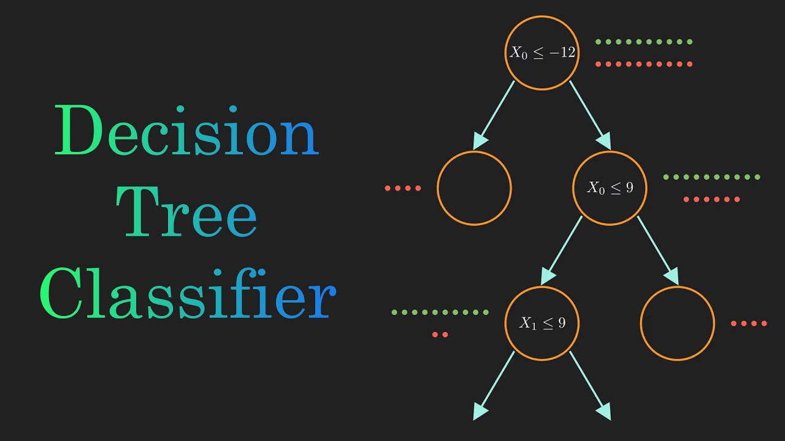

<h1 align="center">Classifiers</h1>

    

## Table of Contents

- [Overview](#overview)
- [Decision Trees](#Decision-Trees)
- [Contact me](#Contact-me)

## Overview

In this project, Implementing Different classifications algorithms using python language.

## Decision Trees

  

### Intuition
A decision tree classifier is a recursive, partition-based tree model that predicts the class y`i. A decision tree uses an axis-parallel hyperplane to split the data space R into two resulting half-spaces or regions which also induces a partition of the input points into D1 and D2, respectively. Each of these regions is recursively split via axis-parallel hyperplanes until the points within an induced partition are relatively pure in terms of their class labels most of the points belong to the same class.
To classify a new test point we have to recursively evaluate which half-space it belongs to until we reach a leaf node in the decision tree, at which point we predict its class as the label of the leaf.

### Implemenation Approach:
Firstly, starting to implement a Decision stump function that is a type of decision tree that consists of only one decision node and two leaf nodes.
Secondly, Decision stump function is used as a black box to build a decision tree which is simply a DFS algorithm such that the visiting step includes data Decision stump function call in case of the non unique classes. Two partitions applied is called in recursive approach.

### Conditions on used datasets:
Implemented Algorithm Could be used on Numeric and categorical attributes.
- In case of numeric attributes, Searching for best splitting lines is applied using evaluating 'gini-index' measure in the mid points between each point and next one after sorting them.
- In case of categorical attributes, Encoding categorical attributes using `LabelEncoder()` and then the logic of numerical attributes is applied.

## Contact me
<!-- contact me -->

      <!-- linkedin -->
       
      &nbsp; &nbsp; &nbsp;
      <!-- gmail -->
      

